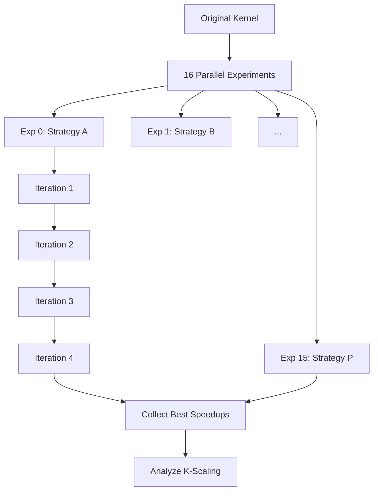

# KernelBench GPU Optimization Experiment

## Overview

This experiment leverages the AIDE (AI-Driven Exploration) framework to automatically optimize GPU kernels for maximum performance. The system employs multiple parallel AI agents to explore different optimization strategies on a distributed Ray cluster with H100 GPUs, achieving significant speedups on computational kernels from the KernelBench benchmark suite.

## Objectives

### Primary Goals
1. **Maximize Speedup**: Achieve the highest possible speedup over baseline PyTorch implementations
2. **Explore Parallelization Strategies**: Discover optimal parallel execution configurations (K@2 through K@64)
3. **Identify Optimization Patterns**: Find common successful optimization techniques across different kernel types
4. **Quantify Diminishing Returns**: Determine the optimal number of parallel attempts for cost-effectiveness

### Research Questions
- What is the optimal K configuration for GPU kernel optimization?
- Where do diminishing returns occur in parallel exploration?
- How does performance scale with the number of optimization attempts?
- Which kernel types benefit most from AI-driven optimization?
- What optimization strategies consistently yield high speedups?

## Experiment Architecture

### System Infrastructure

```
┌──────────────────────────────────────────────────────────────┐
│                    Ray Cluster Head Node                     │
│                    172.26.134.141:6379                      │
│                    (Coordination & GCS)                      │
└──────────────────────────────────────────────────────────────┘
                              │
        ┌─────────────────────┼─────────────────────┐
        │                     │                     │
  ┌─────▼──────┐       ┌─────▼──────┐       ┌─────▼──────┐
  │  Node 141  │       │  Node 74   │       │  Node 220  │
  │  8x H100   │       │  8x H100   │       │  8x H100   │
  │  80GB each │       │  80GB each │       │  80GB each │
  └────────────┘       └────────────┘       └────────────┘
        │                     │                     │
  ┌─────┴─────────────────────┴─────────────────────┴─────┐
  │              Distributed Experiment Actors              │
  │                (16-64 parallel experiments)             │
  └─────────────────────────────────────────────────────────┘
```

### Cluster Configuration
- **Total GPUs**: 24+ NVIDIA H100 80GB HBM3
- **Ray Version**: 2.10.0
- **Network**: High-speed interconnect between nodes
- **Memory**: 80GB HBM3 per GPU
- **Compute**: 16,896 CUDA cores per H100

## K-Scaling Methodology

### Configuration Definitions

| Configuration | Experiments | Iterations | Total Attempts | Description |
|--------------|-------------|------------|----------------|-------------|
| **K@64** | 16 | 4 | 64 | Full exploration with all experiments and iterations |
| **K@32** | 16 | 2 | 32 | All experiments, first 2 iterations only |
| **K@16** | 16 | 1 | 16 | All experiments, first iteration only |
| **K@8** | 8 (sampled) | 1 | 8 | Random subset of experiments |
| **K@4** | 4 (sampled) | 1 | 4 | Small random subset |
| **K@2** | 2 (sampled) | 1 | 2 | Minimal exploration |

### Sampling Strategy
- **K@64, K@32, K@16**: Deterministic (use actual experiment results)
- **K@8, K@4, K@2**: Stochastic (100 random sampling trials)
- **Random Seed**: 42 (for reproducibility)

## Experimental Setup

### KernelBench Tasks

The experiment covers 100+ computational kernels across categories:

#### Task Categories
1. **Tensor Operations** (30+ tasks)
   - Matrix multiplication variants
   - Transpositions and reshaping
   - Element-wise operations

2. **Reduction Operations** (20+ tasks)
   - Sum/mean/max reductions
   - Multi-dimensional reductions
   - Weighted aggregations

3. **Convolution Operations** (25+ tasks)
   - 1D/2D/3D convolutions
   - Depthwise separable convolutions
   - Transposed convolutions
   - Various kernel sizes and strides

4. **Specialized Operations** (25+ tasks)
   - Activation functions (ReLU, GELU, Softmax)
   - Normalization (BatchNorm, LayerNorm, GroupNorm)
   - Pooling operations
   - Attention mechanisms

### Task Naming Convention
```
{task_id}_{operation_description}
Examples:
- 1_2_matrix_multiplication
- 2_34_conv2d_square_input_square_kernel
- 1_47_Sum_reduction_over_a_dimension
```

### AIDE Agent Configuration

```yaml
# Base configuration (contract_gpu.yaml)
num_experiments: 15          # Parallel optimization attempts
num_iterations: 4            # Refinement iterations per experiment
steps_per_iteration: 15      # AI improvement steps per iteration
model: claude-sonnet-4-5
feedback_model: claude-sonnet-4-5

# GPU allocation strategies
gpu_fraction_configs:
  - 1.0   # One experiment per GPU (default)
  - 0.5   # Two experiments per GPU
  - 0.25  # Four experiments per GPU
```

### Optimization Process



## Data Collection and Analysis

### W&B (Weights & Biases) Integration

All experiments are tracked in W&B with hierarchical organization:

```
W&B Projects:
├── kernelbench-level1-k64           # Main experiments
├── kernelbench-level1-k64-part2-*   # Continuation runs
│   ├── 2_33-level2
│   ├── 2_34-level2
│   ├── 2_35-level2
│   ├── 2_37-level2
│   └── 2_39-level2
```

### Metrics Tracked

#### Per Iteration
- `iteration_1_best`: Best speedup in iteration 1
- `iteration_2_best`: Best speedup in iteration 2
- `iteration_3_best`: Best speedup in iteration 3
- `iteration_4_best`: Best speedup in iteration 4

#### Aggregate Metrics
- `mean_best`: Average of maximum speedups across trials
- `best_case`: Absolute best speedup achieved
- `p10`, `p25`, `p50`, `p75`, `p90`: Percentile distributions
- `efficiency`: Speedup per compute unit (mean_best / K)

### Data Extraction Pipeline

```bash
# Extract iteration metrics from W&B
python3 extract_all_projects.py \
  --projects "kernelbench-level1-k64-part2-2_39-level2" \
            "kernelbench-level1-k64-part2-2_37-level2" \
  --output all_iterations_data.csv

# Analyze K-scaling patterns
python3 k_scaling_analysis/scripts/analyze_with_k64.py \
  "algorithmic-research-group/kernelbench-level1-k64" \
  --output data/k_scaling_raw.csv \
  --trials 100

# Generate visualizations
python3 k_scaling_analysis/scripts/visualize_simple.py \
  --input data/k_scaling_raw.csv \
  --output-dir plots/
```


## Running Experiments

### Prerequisites

```bash
# System setup
ulimit -n 65535  # Increase file descriptor limit

# Python dependencies
pip install ray torch wandb pandas numpy matplotlib seaborn

# Start Ray cluster
./start_cluster.sh

# Verify cluster status
ray status --address 172.26.134.141:6379
```

### Launch Commands

#### Standard KernelBench Run
```bash
./run_distributed.sh \
  --task kernelbench \
  --kb-task 1_19 \
  --num-experiments 16 \
  --num-iterations 4 \
  --steps 20 \
  --gpu-fraction 0.25 \
  --wandb-project kernelbench-optimization
```

#### Batch Processing Multiple Tasks
```bash
# Create task list
cat > kb_tasks.txt << EOF
1_2_matrix_multiplication
1_19_complex_computation
2_34_conv2d_operation
EOF

# Run all tasks
while read task; do
  ./run_distributed.sh \
    --task kernelbench \
    --kb-task "$task" \
    --num-experiments 16 \
    --num-iterations 4
done < kb_tasks.txt
```

#### Local Testing
```bash
./run_distributed.sh \
  --local \
  --task kernelbench \
  --kb-task 1_2 \
  --num-experiments 2 \
  --num-iterations 2 \
  --steps 10
```

## Monitoring and Debugging

### Real-time Monitoring
1. **Ray Dashboard**: http://172.26.134.141:8265
   - Cluster utilization
   - Task progress
   - Error logs

2. **W&B Dashboard**: https://wandb.ai/algorithmic-research-group/
   - Speedup curves
   - Iteration metrics
   - Experiment comparison

3. **Log Files**:
   - `k64_study_log.txt`: Experiment history
   - Ray logs: `/tmp/ray/session_latest/logs/`

### Common Issues and Solutions

#### Ray Cluster Connection
```bash
# Issue: "Failed to connect to Ray cluster"
# Solution:
ray stop
./start_cluster.sh
export RAY_ADDRESS='172.26.134.141:6379'
```

#### Anthropic API Errors
```python
# Issue: "APIStatusError: missing response and body"
# Solution: Serialization issue with exceptions
# Workaround: Catch and wrap exceptions properly
```

#### GPU Memory Issues
```bash
# Issue: "CUDA out of memory"
# Solution: Reduce gpu_fraction or num_experiments
--gpu-fraction 0.5  # Instead of 0.25
--num-experiments 8  # Instead of 16
```

## Optimization Strategies

### Successful Patterns Observed

1. **Memory Access Optimization**
   - Coalesced memory access
   - Shared memory utilization
   - Cache-friendly data layouts

2. **Parallelization Techniques**
   - Block/grid dimension tuning
   - Warp-level primitives
   - Tensor core utilization

3. **Algorithmic Improvements**
   - Kernel fusion
   - Reduction optimizations
   - Loop unrolling

4. **Framework Features**
   - torch.compile optimizations
   - Custom CUDA kernels
   - Triton implementations

### Task-Specific Insights

#### Convolution Operations
- Best speedups with im2col optimizations
- Tensor core utilization critical for large kernels
- Depthwise separable benefits from specialized implementations

#### Reduction Operations
- Hierarchical reduction patterns most effective
- Warp shuffle operations provide significant speedup
- Memory bandwidth often the limiting factor

#### Matrix Operations
- CUTLASS-style optimizations highly effective
- Mixed precision (FP16/BF16) yields 2x+ speedups
- Tile size tuning critical for cache efficiency

## Analysis Scripts

### K-Configuration Analysis
```python
# analyze_k_configurations.py
# Compares performance across K@2, K@4, K@8, K@16, K@32, K@64
# Calculates mean_best, percentiles, and efficiency metrics
```

### Iteration Metrics Extraction
```python
# extract_all_projects.py
# Extracts iteration_*_best metrics from multiple W&B projects
# Combines data into unified CSV for analysis
```

### Visualization Suite
```python
# visualize_simple.py
# Generates:
# - K-scaling curves
# - Marginal improvement charts
# - Efficiency plots
# - Task heatmaps
```

## Scientific Rigor

### Experimental Controls
- Fixed random seed (42) for reproducibility
- Consistent evaluation environment
- Standardized speedup calculation
- Baseline comparison for all tasks

### Statistical Analysis
- 100 sampling trials for K@2/4/8 configurations
- Percentile analysis (P10-P90) for distribution understanding
- Coefficient of variation ~1.0 across K values
- Marginal improvement calculations with thresholds

### Validity Considerations
- Warm-up runs excluded from timing
- Multiple timing iterations for stability
- GPU synchronization enforced
- Temperature/frequency throttling monitored

## Repository Structure

```
/home/ubuntu/aide_parallel/
├── run_distributed.sh           # Main launch script
├── run_ray_gpu.py              # Ray experiment orchestrator
├── start_cluster.sh            # Cluster initialization
├── tasks/
│   ├── kernelbench/
│   │   ├── kb_tasks.py        # Task definitions
│   │   ├── optimize.py        # Target optimization file
│   │   └── contract_gpu.yaml  # AIDE configuration
├── k_scaling_analysis/
│   ├── data/
│   │   └── k_scaling_raw.csv  # Collected metrics
│   ├── plots/                 # Generated visualizations
│   ├── scripts/
│   │   ├── analyze_with_k64.py
│   │   └── visualize_simple.py
│   └── reports/
│       └── final_analysis_report.md
├── aideml/
│   └── aide/
│       └── agent.py           # AIDE agent implementation
└── k64_study_log.txt          # Experiment history
```

## Future Work

### Planned Extensions
1. **Extended K Configurations**: Test K@128, K@256
2. **Hybrid Approaches**: Mix iterations and experiments differently
3. **Task Classification**: Group tasks by optimization patterns
4. **Transfer Learning**: Apply successful strategies across similar tasks

### Research Directions
- Automated strategy selection based on task characteristics
- Meta-learning for optimization strategy prediction
- Cross-task knowledge transfer
- Optimization strategy synthesis


## Citations

### Technologies Used
- **AIDE Framework**: AI-Driven Exploration for automated optimization
- **Ray**: Distributed computing framework (ray.io)
- **KernelBench**: GPU kernel benchmark suite
- **Weights & Biases**: Experiment tracking platform

### Hardware
- **NVIDIA H100**: 80GB HBM3 Hopper architecture GPUs
- **InfiniBand**: High-speed cluster interconnect

---